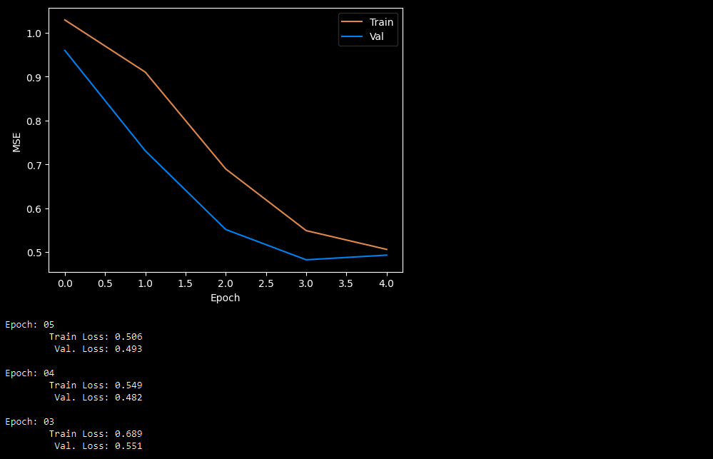
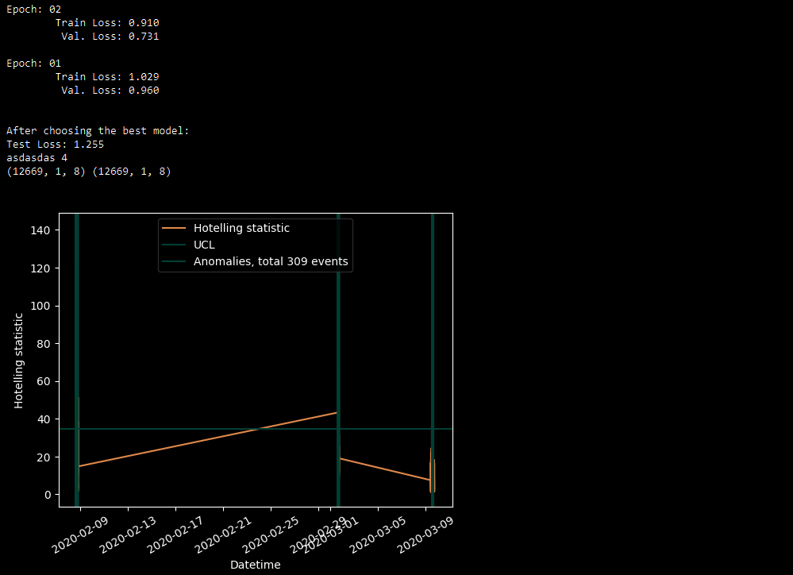

     [](https://www.gnu.org/licenses/gpl-3.0.html) 


# TSAD

**Time Series Analysis for Simulation of Technological Processes**

**The primary purpose** of the TSAD (Python module) is to make life easier for researchers who use ML techniques to solve the following problems: 

* Fault Detection of industrial equipment
* Improvement of technological processes of industrial equipment
  * Performance boost
  * Cost reduction
  * Quality control and management


### Solving Fault Detection problem

In TSAD, the problem of fault detection is reduced to the problem of detecting time series anomalies using a well-known technique:

- Forecast a multivariate Time Series (TS) one point ahead (Also works for univariate TS)
- Compute residuals between forecast and true values
- Apply analysis of residuals and thus find anomalies


#### Documentation

https://tsad.readthedocs.io/

---

#### Getting Started

**Installation** through [PyPi](https://pypi.org/project/tsad): 

`pip install -U tsad`

```python
# Import 
import sys
sys.path.insert(1, '../')
from tsad.base.pipeline import Pipeline
from tsad.base.datasets import load_skab
from tsad.pipelines import ResidualAnomalyDetectionTaskSet

# loading data
dataset = load_skab()
targets = dataset.target_names 
data = dataset.frame.drop(columns=targets).droplevel(level=0)

# Fit and predict
pipeline = Pipeline(ResidualAnomalyDetectionTaskSet)
pred = pipeline.fit_predict(data,n_epochs=5)
```

After that, you can see:





More details you can find [here](https://github.com/waico/tsad/tree/main/Tutorials)

---

#### Thoughts

We encourage the community also to provide feedback on the desired functionality.

We plan to implement:

1. More complex preprocessing of time series, especially in the area of reduction to a single sampling rate (problem of unevenly spaced time series)

2. Implement other SOTA algorithms

3. The ability to implement any model in our pipeline by just providing a link to GitHub. It seems to be a handy feature as many researchers need to verify their models with others.
4. Integration with most forecasting and anomaly detection benchmarks.

Some interesting links: 

1.  https://github.com/salesforce/Merlion 
2.  https://github.com/fastforwardlabs/deepad
3.  https://github.com/HendrikStrobelt/LSTMVis 
4.  https://github.com/TezRomacH/python-package-template 
5.  https://github.com/khundman/telemanom 
6.  https://github.com/signals-dev/Orion 
7.  https://github.com/NetManAIOps/OmniAnomaly 
8.  https://github.com/unit8co/darts
9.  https://github.com/tinkoff-ai/etna-ts
9.  https://github.com/yzhao062/pyod
10.  https://www.radiativetransfer.org/misc/typhon/doc/modules.html#datasets How include dataset
10.  https://github.com/AutoViML/Auto_TS
10.  https://nuancesprog.ru/p/15161/
10.  https://www.sktime.org/en/stable/
10.  https://github.com/zalandoresearch/pytorch-ts
10.  https://github.com/qdata/spacetimeformer
10.  https://joaquinamatrodrigo.github.io/skforecast/0.6.0/index.html

Про архитектуру: 

https://pypi.org/project/catalyst/ 

|  | [Merlion](https://github.com/salesforce/Merlion) | [Alibi Detect](https://github.com/SeldonIO/alibi-detect) | [Kats](https://github.com/facebookresearch/Kats) | [pyod](https://github.com/yzhao062/pyod) | [GluonTS](https://github.com/awslabs/gluon-ts) | RRCF | STUMPY | Greykite | [Prophet](https://github.com/facebook/prophet) | [pmdarima](https://pypi.org/project/pmdarima/) | [deepad](https://github.com/fastforwardlabs/deepad) | TSAD
:--- | :---: | :---:|  :---:  | :---: | :---: | :---: | :---: | :---: | :----: | :---: | :---: | :---:
| Forecasting (Прогнозирование) | ✅ | | ✅ |  | ✅ | | | ✅ | ✅ | ✅ | ✅ | ✅ 
| Anomaly Detection (Поиск аномалий) | ✅ | ✅ | ✅ | ✅ | | ✅ | ✅ | ✅ | ✅ | | ✅ | ✅ 
| Metrics (Алгоритмы оценки) | ✅ | | | ✅ | ✅ | | | | | | ✅ | ✅
| Ensembles (Ансамбли) | ✅ | | | ✅ | | ✅  | | | | | | ✅ 
| Benchmarking (Бенчмарки и датасеты) | ✅ | | | ✅ | ✅ | | | | | | | ✅ 
| Visualization (Визуализация результатов) | ✅ | | ✅ | ✅ | | | | ✅ | ✅ | | | ✅ | ✅ 
| Data preprocessing (Предварительная обработка данных) | | | ✅ | | | | | | | | | ✅ 
| Automated EDA (Автоматизированный разведочный анализ данных) | | | | | | | | | | | | ✅ 

#### Dependencies

* TODO

#### Repo structure

```
  └── repo 
    ├───docs       # documentation
    ├───tutorials   # examples
    ├───tsad       # files of library
```

