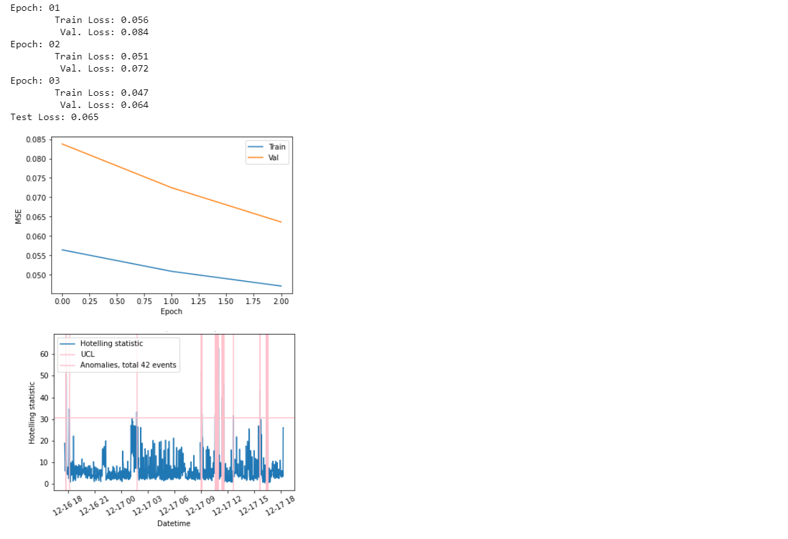

# Time Series Anomaly detection. 

**The primary purpose** of the TSAD (Python module) is to make life easier for researchers who use deep learning techniques for time series. 


In particular, TSAD is created for solving Time Series Anomaly Detection problem by widely known technique:

- Forecast a multivariate Time Series (TS) one point ahead (Also works for univariate TS)
- Compute residuals between forecast and true values
- Apply analysis of residuals and thus find anomalies

---

**The functionality** of the TSAD:

- Preprocessing of Time Series ([tsad.src](https://tsad.readthedocs.io/en/latest/tsad.html#module-tsad.src) module):

  - Automatic search for gaps or groups of missing values and solving this problem (tsad.src.df2dfs)

  - Conversion to a single sample rate or solving unevenly spaced time series problem n(tsad.src.df2dfs)

  - Splitting the entire history dataset, that is, one large time series, into a train and a test (tsad.src.ts_train_test_split) with a specific length of time series in one sample. Also, you can adjust the step, intersection of samples, and much more.
  - Collecting samples in batches by using a Loader (tsad.src.Loader)
- Forecasting multi-step ahead both multivariate and univariate time series. As forecasting algorithms were implemented or will be implemented [tsad.models](https://tsad.readthedocs.io/en/latest/tsad.html#module-tsad.models):

  - A simple one-layer LSTM network (LSTM) 
  -   A two-layer LSTM network (DeepLSTM)
  - bi-directional LSTM network (BLSTM)
  - LSTM encoder-decoder (EncDec-AD) 
  - LSTM autoencoder (LSTM-AE) 
  - Convolutional LSTM network (ConvLSTM) 
  - Convolutional Bi-directional LSTM network (CBLSTM) 
  - Multi-Scale Convolutional Recurrent Encoder-Decoder (MSCRED)
- Calculation of residuals between forecast and real values. By default, the absolute difference is calculated. Still, you can write your function taking into account the requirements (requirements and other functions for calculating the residuals can be found in [tsad.generate_residuals](https://tsad.readthedocs.io/en/latest/tsad.html#module-tsad.generate_residuals)) and use it in the pipeline.
- Residual analysis to find anomalies. There are various techniques for analyzing residuals. By default, [T2 statistic](https://en.wikipedia.org/wiki/Hotelling's_T-squared_distribution) is implemented , but you can write your function taking into account the requirements (requirements and other functions for analyzing residuals can be found in [tsad. stastics](https://tsad.readthedocs.io/en/latest/tsad.html#module-tsad.stastics)) and use it in the pipeline.
- Grouping of repeated time series values. tsad.src.split_by_repeated
- Convenient loading of hyperparameters.  tsad.useful.iterators.MeshLoader

#### Documentation

https://tsad.readthedocs.io/

**The main class of the pipeline is** [tsad.main.DL_AD](https://tsad.readthedocs.io/en/latest/tsad.html#module-tsad.main)

---

#### Getting Started

**Installation** through [PyPi](https://pypi.org/project/tsad): 

`pip install -U tsad`

1. Primitive case 

```python
import pandas as pd
from tsad import main

# Loading ideal time series without any problem
df = pd.read_csv('example.csv',parse_dates='DT').set_index('DT') 

pipeline = maim.DL_AD() 
pipeline.fit(df)
list_anomalies = pipeline.predict_anomaly(df)
forecast = pipeline.forecast(df)
```

2. Advanced case

```python
import pandas as pd
from tsad import main
from tsad.src import df2dfs
import torch

# Loading time series
df = pd.read_csv('example.csv',parse_dates='DT').set_index('DT') 

class my_preproc_func(...):
    ...
    

pipeline = maim.DL_AD(preproc=my_preproc_func) 
pipeline.fit(df2dfs(df),
             n_epochs=3,
             optimiser=(torch.optim.Adam,{‘lr’:0.001}),
             batch_size=8,
             len_seq=60*3,
             test_size=0.4)
```

After that, you can see:



And then you can perform:

```python
list_anomalies = pipeline.predict_anomaly(df2dfs(df))
forecast = pipeline.forecast(df2dfs(df))
```

More details you can find [here](https://github.com/waico/tsad/tree/main/examples)

---

#### Thoughts

We encourage the community also to provide feedback on the desired functionality.

We plan to implement:

1. More complex preprocessing of time series, especially in the area of reduction to a single sampling rate (problem of unevenly spaced time series)

2. Implement other SOTA algorithms

3. The ability to implement any model in our pipeline by just providing a link to GitHub. It seems to be a handy feature as many researchers need to verify their models with others.
4. Integration with most forecasting and anomaly detection benchmarks.

Some interesting links: 

1.  https://github.com/salesforce/Merlion 
2.  https://github.com/fastforwardlabs/deepad
3.  https://github.com/HendrikStrobelt/LSTMVis 
4.  https://github.com/TezRomacH/python-package-template 
5.  https://github.com/khundman/telemanom 
6.  https://github.com/signals-dev/Orion 
7.  https://github.com/NetManAIOps/OmniAnomaly 

#### Dependencies

* python==3.7.6
* numpy>=1.20.0
* pandas>=1.0.1
* matplotlib>=3.1.3
* scikit-learn>=0.24.1
* torch==1.5.0

#### Repo structure

```
  └── repo 
    ├───docs       # documentation
    ├───examples   # examples
    ├───tsad       # files of library
```

